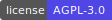
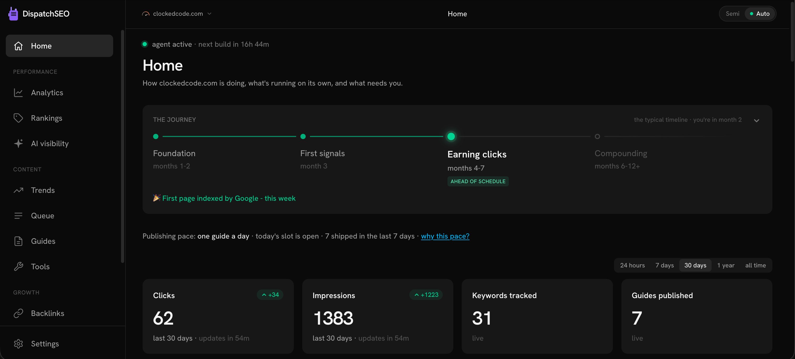
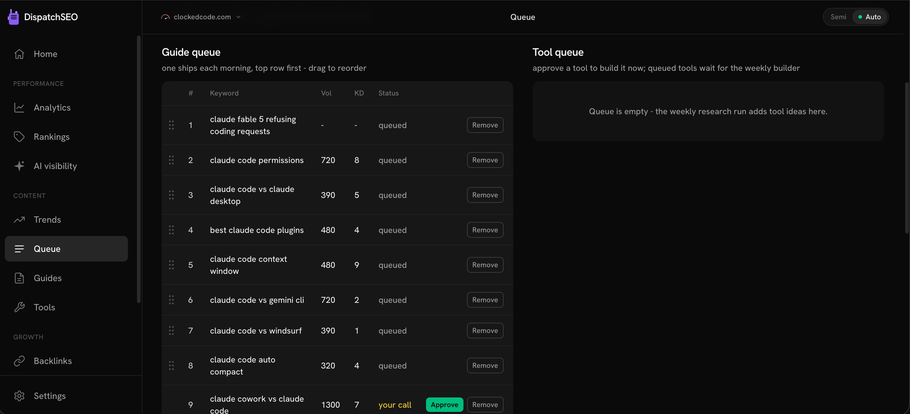
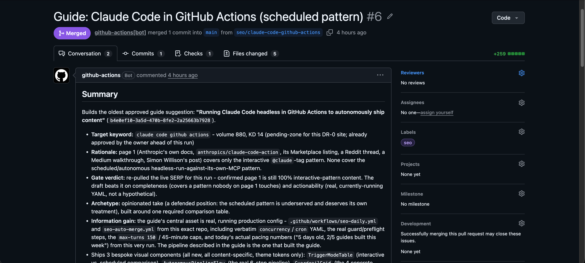
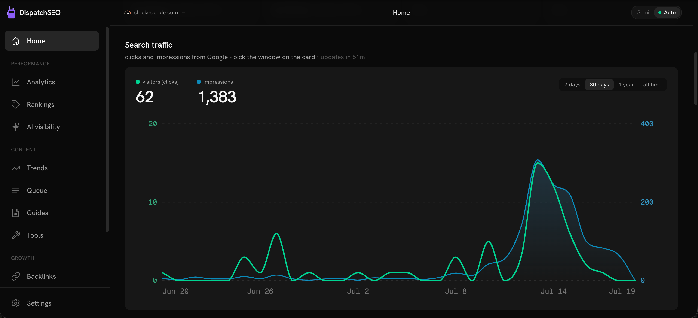
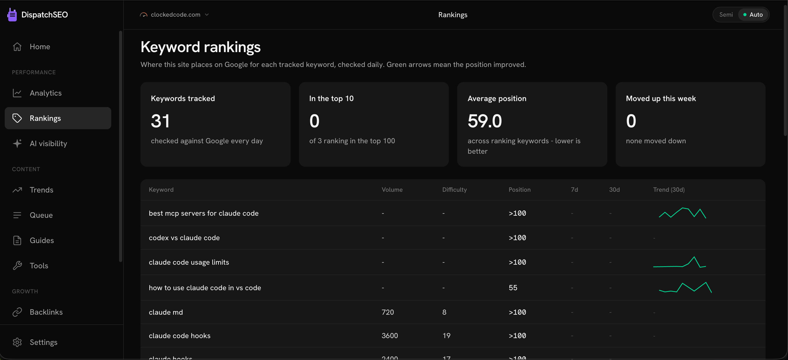

<p align="center">
  <a href="https://dispatchseo.com">
    
  </a>
</p>

<h1 align="center">DispatchSEO</h1>

<p align="center"><b>Turn Claude Code into your SEO manager.</b></p>

<p align="center">
  <a href="LICENSE"></a>
</p>

<p align="center">
  <a href="https://dispatchseo.com">Website</a>
  &nbsp;&middot;&nbsp;
  <a href="https://dispatchseo.com/docs">Docs</a>
  &nbsp;&middot;&nbsp;
  <a href="docs/SELF_HOSTING.md">Self-hosting guide</a>
  &nbsp;&middot;&nbsp;
  <a href="https://github.com/NeoZi12/dispatchseo/discussions">Discussions</a>
  &nbsp;&middot;&nbsp;
  <a href="https://dispatchseo.com">Cloud waitlist</a>
</p>

<p align="center">
The open-source alternative to SEObot and Outrank, built for Claude Code.
Other SEO tools learn about your product by crawling your homepage. Your
Claude Code already knows your product, because it probably built half of it.
DispatchSEO gives that agent the missing pieces: a research playbook, a
content pipeline that ships pull requests, rank tracking, and a dashboard
where you stay in control.
</p>

<p align="center">
  <a href="https://vercel.com/new/clone?repository-url=https%3A%2F%2Fgithub.com%2FNeoZi12%2Fdispatchseo&project-name=dispatchseo&repository-name=dispatchseo&stores=%5B%7B%22type%22%3A%22integration%22%2C%22integrationSlug%22%3A%22supabase%22%2C%22productSlug%22%3A%22supabase%22%2C%22protocol%22%3A%22storage%22%7D%5D"></a>
  &nbsp;
  <a href="https://vercel.com/new/clone?repository-url=https%3A%2F%2Fgithub.com%2FNeoZi12%2Fdispatchseo&project-name=dispatchseo&repository-name=dispatchseo"></a>
</p>

<p align="center">
Neither asks you for anything. Deploy, open your new site, and it walks you
through the rest - the first button also creates a free Supabase database
for you; the second is for connecting a database you already have
(<a href="docs/SELF_HOSTING.md">guide</a>).
</p>

<p align="center">Prefer your own machine? No cloud accounts, one command:</p>

```bash
git clone https://github.com/NeoZi12/dispatchseo &&
  cd dispatchseo &&
  sh start.sh
```

<p align="center">When it finishes it prints your dashboard URL - open it
and the setup wizard takes it from there. Already running something on
port 3000? It picks the next free port automatically. On Windows, paste
this in WSL or Git Bash.</p>

<p align="center"><i>Self-hosted has zero feature limitations. Everything the
paid cloud will do, this repo does today, in your own accounts, at $0.</i></p>

<p align="center">
  
</p>

## How it works

1. **Your agent researches.** Claude Code connects to DispatchSEO over MCP,
   reads the served playbook, and mines keywords from your Search Console
   data, Google Autocomplete, and what it already knows about your product.
   Ideas land in a queue with the reasoning attached.
2. **You approve, or don't.** Each idea is a card on the dashboard: the
   keyword, why it's winnable, the angle. Approve, reject, or reorder.
   Prefer full autopilot? Flip on auto mode and skip the queue entirely.
3. **The pipeline builds.** Every morning a GitHub Action picks the oldest
   approved idea and builds it into a real pull request against your site's
   repo: a guide or a small free tool, checked against the live SERP and run
   through a sameness reviewer so page twelve doesn't read like page three.
4. **It tracks what happened.** Daily rank checks, hourly Search Console
   snapshots, index verification, and a journey view that tells you which
   SEO stage you're actually in. When a scheduled job breaks, you get a red
   banner and an email instead of silence.

The backend is deliberately boring: state, scheduling, and an approval gate.
The thinking happens in your agent, where your product knowledge already
lives.

<table>
  <tr>
    <td></td>
    <td></td>
  </tr>
  <tr>
    <td></td>
    <td></td>
  </tr>
</table>

## What's in the box

- **MCP server** with ~40 tools: the queue, keywords, rankings, pages, GSC
  stats, backlink prospects, trend topics, site profile. Anything the
  dashboard can do, your agent can do over MCP; parity between the two is a
  hard rule in this codebase.
- **Trend radar**: scan for rising topics in your niche, expand a topic into
  concrete guide angles, and queue the good ones.
- **Guide and tool builders**: guides publish on a pace matched to your
  site's age (so a three-week-old blog doesn't suddenly ship 30 posts);
  free-tool ideas build on approval.
- **Backlink playbook**: a prospect list prefilled with your product's copy,
  tracked per submission.
- **Multi-site**: one deployment manages any number of sites. Each project
  gets its own MCP token, its own data, its own settings.
- **A password-gated dashboard** for the one human in the loop.

## What it costs to run

Nothing, unless you want paid data. The tiers stack:

| Tier | Price | What you get |
| --- | --- | --- |
| Search Console only | $0 | Rankings from GSC, keyword ideas from Autocomplete plus your own impression data |
| + SerpApi free key | $0 | Live SERP checks, real positions weekly (250 free searches/month) |
| + DataForSEO | pay per call | Search volume, keyword difficulty, domain rating |

Free mode finds keywords you can win. Paid mode also knows which ones are
worth winning.

## What you need

- Your site's source in a GitHub repo. The pipeline ships content as pull
  requests, so git-based sites only; WordPress won't work.
- A Claude subscription with Claude Code. Your agent is the engine and it
  runs on your existing plan.
- Somewhere to run it: either free Vercel + Supabase accounts, or any
  machine with Docker (~1 GB RAM - a $5 VPS or your laptop).
- Google Search Console access to your site.

## Quick start

Two ways in, same product either way
([docs/SELF_HOSTING.md](docs/SELF_HOSTING.md) covers both):

- **Docker** - the one command above. Database, migrations, and cron
  schedules are all bundled; open the dashboard and the setup wizard takes
  over.
- **Free cloud tiers** - click a deploy button above (Vercel + Supabase),
  run the one-file database setup, and enable the GitHub Actions schedule.

Either way, the last step is pasting one command into Claude Code inside
your site's repo. Your agent does the rest of the install itself, including
writing its own workflow files and setting its own secrets.

There's also an [llms.txt](public/llms.txt) and a [SKILL.md](SKILL.md) if
you'd rather point an agent at this repo and let it figure the setup out.

## Run it locally

```bash
git clone https://github.com/NeoZi12/dispatchseo
cd dispatchseo
pnpm install
cp .env.local.example .env.local
pnpm dev
```

Fill in `.env.local` (Supabase + the three secrets) before starting, then
open the dashboard on **localhost:3000**.

`pnpm build` is the typecheck - run it before opening a PR. There is no
separate lint or test setup.

## Cloud version

A hosted version is coming for people who'd rather not manage a Vercel
deployment: bundled SERP data, one-click Search Console connection, managed
crons. Join the waitlist at [dispatchseo.com](https://dispatchseo.com).
Self-hosting will stay feature-complete either way; the cloud sells
convenience, not capability.

## Architecture, briefly

Next.js App Router on Vercel, Supabase for state, GitHub Actions for
schedules and builds, `mcp-handler` for the MCP server at `/api/mcp`. One
deployment is multi-tenant: the MCP bearer token selects the project, crons
loop over all projects, the dashboard switches with a cookie.
[CLAUDE.md](CLAUDE.md) has the full conventions; it's written for agents,
which turns out to make it decent documentation for people.

## Contributing

Issues before PRs, and you must understand every line you submit, including
the AI-assisted ones. Details in [CONTRIBUTING.md](CONTRIBUTING.md).
Questions go to [Discussions](https://github.com/NeoZi12/dispatchseo/discussions);
vulnerabilities go through [private reporting](SECURITY.md).

## License

[AGPL-3.0](LICENSE). Use it, self-host it, fork it. If you run a modified
version as a service, share the source. That's the whole deal.

---

[](https://star-history.com/#NeoZi12/dispatchseo)
